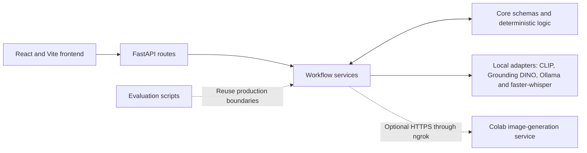

# ClearSpace


ClearSpace is a human-in-the-loop multimodal AI web application for decluttering
and reorganising an indoor space from one photograph. It turns detected
belongings into reviewable **Declutter Decisions**, a deterministic **Tidy Plan
Checklist**, conditional **Storage Ideas**, optional **Marketplace Listings**,
and an optional **AI Visual Preview**.

The application supports rather than replaces user judgement. Users can correct
labels, change or exclude decisions, review voice transcripts, select items and
explicitly confirm choices before they affect later stages. Nothing is disposed
of or published automatically.

ClearSpace was developed for **CM3070 Computer Science Final Year Project,
Brief 4.1: Orchestrating AI Models to Achieve a Goal**. Its contribution is the
coordination of specialised vision, language, speech and image-generation
components through stable identity, validated contracts and recoverable
workflow boundaries, rather than training a new foundation model.

## Main features and workflows

| Workflow | User review | Outputs |
|---|---|---|
| **Declutter** | Correct labels; change Keep, Sell, Donate or Discard decisions; exclude items; confirm choices | Confirmed summary and optional editable Marketplace Listings for eligible Sell items |
| **Reorganise** | Correct labels and include or exclude detected items from the plan; no Keep, Sell, Donate or Discard decisions | Tidy Plan Checklist, Storage Ideas and optional AI Visual Preview |
| **Both** | Complete the Declutter review and confirmation first | Independent Tidy up and Marketplace Listings actions; the checklist also includes bounded departure steps for confirmed Sell, Donate and Discard items |

Optional written context or a reviewed voice transcript can describe priorities
that are not visible in the photograph. Marketplace Listings remain editable
drafts and are never sent to a marketplace.

## Key engineering contributions

- **Stable identity:** `item_id` is the only cross-stage identity. Detector,
  corrected and display labels may change without retargeting an object.
- **Server-derived eligibility:** the backend replays confirmation to derive
  Keep and Sell sets; the client cannot supply trusted eligibility lists.
- **Semantic validation:** structured model output is checked for exact identity
  coverage and domain rules, not merely valid JSON.
- **Deterministic organisation planning:** the Tidy Plan Checklist and Storage
  Ideas use repeatable, evidence-gated rules instead of a production planning
  LLM.
- **Reviewed speech input:** transcription is editable and changes context only
  after an explicit user action.
- **Asynchronous consistency:** separate operation counters and ownership tokens
  prevent late responses from overwriting newer review state or listing edits.
- **Graceful optional generation:** an unavailable or low-fidelity AI Visual
  Preview does not remove the checklist, Storage Ideas, Declutter Decisions or
  Marketplace Listings.

## High-level architecture



The frontend owns temporary interaction state. FastAPI routes validate transport
data and map expected errors, services coordinate workflow operations, and core
modules enforce schemas, identity and deterministic transformations. Most
inference runs locally. The optional image-generation service runs separately on
a Colab GPU and receives the original photograph across the documented network
boundary.

## Tech stack

- **Frontend:** React, Vite and Tailwind CSS
- **Backend:** Python 3.11, FastAPI and Pydantic
- **Vision:** CLIP and Grounding DINO
- **Language:** local Ollama models for Declutter Decisions and Marketplace Listings
- **Speech:** faster-whisper by default, with OpenAI Whisper supported; PyAV decoding
- **Image generation:** Stable Diffusion 1.5 + depth ControlNet, MiDaS, Colab and ngrok
- **Verification:** pytest, FastAPI TestClient/httpx, Vitest and React Testing Library

## Getting started

Prerequisites are Python 3.11, Conda, Node.js/npm and Ollama. Vision and speech
weights must be provisioned locally; model weights, real environment files and
evaluation images are not committed.

### Backend

From the repository root in Anaconda Prompt or a Conda-enabled Command Prompt:

```cmd
conda create -n clearspace-fyp python=3.11
conda activate clearspace-fyp
cd backend
python -m pip install -r requirements.txt
python -m pip install git+https://github.com/openai/CLIP.git
if not exist .env copy .env.example .env
```

Configure the paths and services described in
[`backend/.env.example`](backend/.env.example), make the configured Ollama model
available, then run from `backend/`:

```cmd
python -m uvicorn app.main:app --host 127.0.0.1 --port 8000
```

### Frontend

In a second terminal:

```cmd
cd frontend
npm ci
npm run dev
```

Open <http://localhost:5173>. The FastAPI documentation is available at
<http://127.0.0.1:8000/docs>.

### Optional AI Visual Preview

Follow the [image-generation service guide](colab_service/README.md) and open
the [Colab launcher notebook](colab_service/ClearSpace_Image_Gen.ipynb). After
the notebook reports a healthy ngrok URL, set `IMAGE_GEN_BASE_URL` in
`backend/.env` and restart the backend.

## Repository structure

```text
backend/
  app/
    api/          HTTP routes
    services/     Workflow orchestration and eligibility
    core/         Schemas, identity, validation and deterministic planning
    models/       Local model adapters and the remote image client
  evaluation/     Evaluation harnesses, fixtures, labels and documented findings
  tests/          Unit, system, integration and acceptance material
frontend/src/     API contracts, workflow hooks and interface components
colab_service/    Optional image-generation service and launcher notebook
```

## Testing

Ordinary suites use fakes at expensive model and network boundaries. Real-model
integration is separate and opt-in, so passing the standard suites establishes
software behaviour rather than general model accuracy.

```cmd
:: From backend/
python -m pytest -q

:: From frontend/
npm test
npm run build

:: From the repository root
python -m pytest colab_service/tests -q
git diff --check
```

Evaluation covered deterministic correctness, real-model integration, bounded
model behaviour and user acceptance. P1-P3 tested the earlier interface and
motivated focused refinements. P4-P6 tested the refined interface and completed
all nine workflow attempts independently; usefulness improved descriptively,
and later ease and control ratings were strong. The small cohorts support an
iterative usability finding, not statistical significance or causation. Model
evaluation also informed deterministic organisation planning and the decision
to keep the AI Visual Preview optional.

## Limitations

- Object detection is not exhaustive. Users can correct and exclude detections
  but cannot manually add a missed object.
- Declutter Decisions and Marketplace Listings require review. Conditions are
  seller declarations, no price is estimated, and nothing is published.
- The development hardware did not provide a suitable dedicated local CUDA GPU,
  so the image-generation service runs on Colab. Stable Diffusion 1.5 + depth
  ControlNet receives no object masks or target-position geometry; the AI Visual
  Preview is illustrative rather than item-preserving or spatially authoritative.
- Workflow state is held in the browser and is not retained across reloads or a
  new session. Sending a photo for the AI Visual Preview crosses the remote
  service boundary.

## Documentation

- [Evaluation record](backend/evaluation/README.md): detailed methods, model
  experiments, evidence boundaries and historical alternatives
- [Image-generation service](colab_service/README.md): deployment, API contract,
  runtime evidence, security and quality findings
- [Real-model integration](backend/tests/integration/README.md): prerequisites,
  commands and scope
- [System tests](backend/tests/system/README.md): API vertical slices and manual
  end-to-end checks
- [Evaluation labels](backend/evaluation/labels/README.md): annotation contracts
  and detector-adjudication methodology
